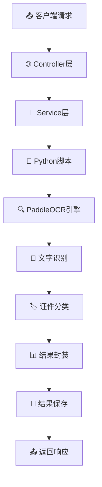

# 🔍 OCR智能证件识别系统

<div align="center">


 
**基于Spring Boot + Python PaddleOCR的企业级证件识别解决方案**

[功能特性](#-功能特性) • [快速开始](#-快速开始) • [API文档](#-api文档) • [部署指南](#-部署指南) • [贡献指南](#-贡献指南)

</div>

---

## 📋 项目简介

OCR智能证件识别系统是一个基于Spring Boot和Python PaddleOCR开发的企业级证件识别解决方案。系统采用前后端分离架构，提供RESTful API接口，支持多种证件类型的自动识别、分类和信息提取。

### 🎯 核心价值

- **🚀 高效识别**：基于百度PaddleOCR引擎，识别准确率高达95%+
- **🔧 易于集成**：标准REST API，支持多语言客户端集成
- **📈 企业级**：支持高并发、批量处理，满足企业级应用需求
- **🛡️ 安全可靠**：完善的异常处理和日志记录机制
- **📱 跨平台**：支持Windows、Linux、macOS多平台部署

## ✨ 功能特性

### 🔍 智能识别
- **多证件类型**：身份证、营业执照、驾驶证、护照等
- **高精度OCR**：基于PaddleOCR深度学习模型
- **智能分类**：自动识别证件类型并分类
- **关键信息提取**：提取姓名、证件号等关键信息

### 📁 批量处理
- **单文件处理**：支持单个图片文件识别
- **批量处理**：支持目录下所有图片批量识别
- **多格式支持**：JPG、PNG、BMP、TIFF、WebP等
- **结果导出**：自动保存识别结果为JSON格式

### 🌐 API服务
- **RESTful API**：标准REST接口设计
- **Swagger文档**：完整的API文档和在线测试
- **异步处理**：支持异步任务处理
- **状态监控**：实时处理状态和进度查询

### 🛠️ 技术架构
- **后端框架**：Spring Boot 2.7.18
- **OCR引擎**：Python PaddleOCR + OpenCV
- **API文档**：SpringDoc OpenAPI 3
- **构建工具**：Maven 3.6+
- **运行环境**：Java 8+ / Python 3.8+

## 🚀 快速开始

### 📋 环境要求

| 组件 | 版本要求 | 说明 |
|------|----------|------|
| **Java** | JDK 8+ | 推荐使用JDK 11或更高版本 |
| **Maven** | 3.6+ | 项目构建工具 |
| **Python** | 3.8+ | OCR引擎运行环境 |
| **内存** | 4GB+ | 推荐8GB以上 |
| **磁盘** | 2GB+ | 包含模型文件存储空间 |

### 🔧 安装步骤

#### 1️⃣ 克隆项目
```bash
git clone https://github.com/your-username/ocr-system.git
cd ocr-system
```

#### 2️⃣ 安装Python依赖
```bash
# 使用pip安装
pip install paddleocr opencv-python numpy

# 或使用conda安装
conda install paddleocr opencv numpy
```

#### 3️⃣ 配置应用
编辑 `src/main/resources/application.properties`：
```properties
# 服务器配置
server.port=8080

# OCR配置
ocr.python-path=python
ocr.script-path=src/main/resources/python/ocr_classifier.py
ocr.timeout-seconds=300
ocr.debug-mode=false
ocr.max-file-size-mb=10
ocr.supported-formats=jpg,jpeg,png,bmp,tiff,webp

# 日志配置
logging.level.com.twx.ocr=INFO
```

#### 4️⃣ 启动应用
```bash
# 使用Maven启动
./mvnw spring-boot:run

# 或者先编译再运行
./mvnw clean package
java -jar target/OCR-0.0.1-SNAPSHOT.jar
```

#### 5️⃣ 验证安装
```bash
# 检查服务状态
curl http://localhost:8080/api/ocr/health

# 预期响应
OCR服务运行正常
```

### 🎉 首次使用

1. **访问API文档**：http://localhost:8080/swagger-ui.html
2. **准备测试图片**：将证件图片放在项目目录下
3. **测试识别功能**：
   ```bash
   curl -X POST "http://localhost:8080/api/ocr/process-single" \
     -H "Content-Type: application/x-www-form-urlencoded" \
     -d "imagePath=/path/to/your/image.jpg"
   ```

## 📖 API文档

### 🌐 在线文档

| 文档类型 | 访问地址 | 说明 |
|----------|----------|------|
| **Swagger UI** | http://localhost:8080/swagger-ui.html | 标准API文档界面 |
| **OpenAPI JSON** | http://localhost:8080/v3/api-docs | API规范JSON格式 |

### 🔧 API功能

#### 🎯 核心接口

| 接口 | 方法 | 功能 | 示例 |
|------|------|------|------|
| `/api/ocr/process` | POST | 完整OCR处理 | 支持单文件和批量处理 |
| `/api/ocr/process-single` | POST | 单文件处理 | 快速单图片识别 |
| `/api/ocr/process-batch` | POST | 批量处理 | 目录下所有图片 |
| `/api/ocr/health` | GET | 健康检查 | 服务状态监控 |

#### 📝 请求示例

**单文件处理**
```bash
curl -X POST "http://localhost:8080/api/ocr/process-single" \
  -H "Content-Type: application/x-www-form-urlencoded" \
  -d "imagePath=D:/images/idcard.jpg"
```

**完整处理请求**
```bash
curl -X POST "http://localhost:8080/api/ocr/process" \
  -H "Content-Type: application/json" \
  -d '{
    "imagePath": "D:/images/idcard.jpg",
    "batchProcess": false,
    "saveToFile": true,
    "outputDir": "output"
  }'
```

**批量处理**
```bash
curl -X POST "http://localhost:8080/api/ocr/process-batch" \
  -H "Content-Type: application/x-www-form-urlencoded" \
  -d "directoryPath=D:/images/"
```

#### 📊 响应格式

**✅ 成功响应**
```json
{
  "success": true,
  "timestamp": "2024-01-01T12:00:00",
  "result": {
    "imagePath": "D:/images/idcard.jpg",
    "documentType": "身份证",
    "recTexts": [
      "中华人民共和国",
      "居民身份证",
      "姓名：张三",
      "性别：男",
      "民族：汉",
      "出生：1990年1月1日",
      "住址：北京市朝阳区xxx街道",
      "公民身份号码：110101199001011234"
    ],
    "success": true,
    "confidence": "高"
  },
  "totalProcessed": 1,
  "successCount": 1,
  "failureCount": 0
}
```

**❌ 错误响应**
```json
{
  "success": false,
  "errorMessage": "文件不存在或格式不支持",
  "timestamp": "2024-01-01T12:00:00",
  "totalProcessed": 1,
  "successCount": 0,
  "failureCount": 1
}
```

**📊 批量处理响应**
```json
{
  "success": true,
  "timestamp": "2024-01-01T12:00:00",
  "results": [
    {
      "imagePath": "image1.jpg",
      "documentType": "身份证",
      "success": true
    },
    {
      "imagePath": "image2.jpg",
      "documentType": "营业执照",
      "success": true
    }
  ],
  "totalProcessed": 2,
  "successCount": 2,
  "failureCount": 0
}
```

## 🏷️ 支持的证件类型

<div align="center">

| 证件类型 | 识别精度 | 提取信息 | 状态 |
|----------|----------|----------|------|
| **🆔 身份证** | 95%+ | 姓名、性别、民族、出生日期、住址、身份证号 | ✅ 支持 |
| **🏢 营业执照** | 93%+ | 企业名称、统一社会信用代码、法定代表人、注册资本 | ✅ 支持 |
| **🚗 驾驶证** | 92%+ | 姓名、证号、准驾车型、有效期限、初次领证日期 | ✅ 支持 |
| **📘 护照** | 90%+ | 姓名、护照号、签发机关、签发日期、有效期 | ✅ 支持 |
| **🎓 学历证书** | 88%+ | 姓名、学校、专业、毕业时间 | 🔄 开发中 |
| **🏥 医保卡** | 85%+ | 姓名、卡号、参保地 | 🔄 开发中 |

</div>

## 📁 支持的文件格式

<div align="center">

| 格式 | 扩展名 | 最大尺寸 | 推荐用途 |
|------|--------|----------|----------|
| **JPEG** | .jpg, .jpeg | 10MB | 📱 手机拍照 |
| **PNG** | .png | 10MB | 🖥️ 屏幕截图 |
| **BMP** | .bmp | 10MB | 🖼️ 无损图像 |
| **TIFF** | .tiff, .tif | 10MB | 📄 扫描文档 |
| **WebP** | .webp | 10MB | 🌐 网络图片 |

</div>

## ⚙️ 配置说明

### 📋 核心配置

| 配置项 | 说明 | 默认值 | 示例 |
|--------|------|--------|------|
| `ocr.python-path` | Python解释器路径 | `python` | `/usr/bin/python3` |
| `ocr.script-path` | Python脚本路径 | `src/main/resources/python/ocr_classifier.py` | 相对路径 |
| `ocr.timeout-seconds` | 脚本执行超时时间（秒） | `300` | `600` |
| `ocr.debug-mode` | 是否启用调试模式 | `false` | `true` |
| `ocr.max-file-size-mb` | 最大文件大小（MB） | `10` | `20` |
| `ocr.supported-formats` | 支持的文件格式 | `jpg,jpeg,png,bmp,tiff,webp` | 逗号分隔 |

### 🔧 高级配置

```properties
# 性能优化
ocr.thread-pool-size=10
ocr.queue-capacity=100

# 缓存配置
ocr.cache.enabled=true
ocr.cache.ttl=3600

# 安全配置
ocr.max-requests-per-minute=60
ocr.allowed-origins=*
```

## 🏗️ 项目架构

### 📁 目录结构

```
OCR-System/
├── 📂 src/main/java/com/twx/ocr/
│   ├── 📂 config/              # ⚙️ 配置类
│   │   ├── OpenApiConfig.java  # API文档配置
│   │   └── OcrConfig.java      # OCR核心配置
│   ├── 📂 controller/          # 🌐 REST控制器
│   │   └── OcrController.java  # OCR API接口
│   ├── 📂 dto/                 # 📦 数据传输对象
│   │   ├── OcrRequest.java     # 请求参数
│   │   ├── OcrResponse.java    # 响应结果
│   │   └── DocumentClassificationResult.java
│   ├── 📂 service/             # 🔧 业务服务层
│   │   ├── OcrService.java     # 服务接口
│   │   └── impl/PythonOcrService.java # 实现类
│   ├── 📂 exception/           # ❌ 异常处理
│   │   ├── OcrException.java   # 自定义异常
│   │   └── GlobalExceptionHandler.java
│   └── 📂 util/                # 🛠️ 工具类
│       └── FileUtils.java      # 文件操作工具
├── 📂 src/main/resources/
│   ├── 📂 python/              # 🐍 Python脚本
│   │   └── ocr_classifier.py   # OCR识别脚本
│   └── application.properties  # 📋 应用配置
├── 📂 src/test/                # 🧪 测试代码
└── 📂 docs/                    # 📚 项目文档
```

### 🔄 处理流程



## 🚀 部署指南

### 🐳 Docker部署

```dockerfile
# Dockerfile
FROM openjdk:8-jre-slim

# 安装Python和依赖
RUN apt-get update && apt-get install -y python3 python3-pip
RUN pip3 install paddleocr opencv-python numpy

# 复制应用
COPY target/OCR-0.0.1-SNAPSHOT.jar app.jar

# 暴露端口
EXPOSE 8080

# 启动应用
ENTRYPOINT ["java", "-jar", "/app.jar"]
```

```bash
# 构建镜像
docker build -t ocr-system:latest .

# 运行容器
docker run -d -p 8080:8080 --name ocr-service ocr-system:latest
```

### ☁️ 云服务部署

**阿里云ECS部署**
```bash
# 1. 安装Java环境
sudo yum install java-1.8.0-openjdk

# 2. 安装Python环境
sudo yum install python3 python3-pip

# 3. 安装OCR依赖
pip3 install paddleocr opencv-python numpy

# 4. 上传并启动应用
nohup java -jar OCR-0.0.1-SNAPSHOT.jar > app.log 2>&1 &
```

### 🔧 性能优化

```properties
# JVM优化参数
-Xms2g -Xmx4g -XX:+UseG1GC

# 应用配置优化
server.tomcat.max-threads=200
server.tomcat.min-spare-threads=20
spring.datasource.hikari.maximum-pool-size=20
```

## 🛠️ 开发指南

### 🔌 扩展新证件类型

1. **修改Python脚本**
```python
# 在 classify_document_type_from_texts 方法中添加
new_doc_keywords = ['新证件', '关键词1', '关键词2']
new_doc_score = sum(1 for keyword in new_doc_keywords if keyword in text_content)

# 添加到scores字典
scores['新证件类型'] = new_doc_score
```

2. **更新配置**
```properties
# 添加新的支持类型
ocr.supported-document-types=身份证,营业执照,驾驶证,护照,新证件类型
```

3. **测试验证**
```bash
# 测试新证件类型
curl -X POST "http://localhost:8080/api/ocr/process-single" \
  -d "imagePath=/path/to/new-document.jpg"
```

### 🧪 单元测试

```java
@Test
public void testOcrProcessing() {
    OcrRequest request = new OcrRequest();
    request.setImagePath("test-image.jpg");

    OcrResponse response = ocrService.processOcr(request);

    assertThat(response.getSuccess()).isTrue();
    assertThat(response.getResult().getDocumentType()).isNotNull();
}
```

## 🔍 故障排除

### ❓ 常见问题

<details>
<summary><strong>🐍 Python环境问题</strong></summary>

**问题**: `ModuleNotFoundError: No module named 'paddleocr'`

**解决方案**:
```bash
# 检查Python版本
python --version

# 安装PaddleOCR
pip install paddleocr

# 如果使用conda
conda install paddleocr -c conda-forge
```
</details>

<details>
<summary><strong>🔤 中文乱码问题</strong></summary>

**问题**: 识别结果出现乱码

**解决方案**:
```properties
# 设置调试模式
ocr.debug-mode=true

# 检查系统编码
export PYTHONIOENCODING=utf-8
```
</details>

<details>
<summary><strong>⚡ 性能优化</strong></summary>

**问题**: 识别速度慢

**解决方案**:
```properties
# 调整超时时间
ocr.timeout-seconds=600

# 启用GPU加速（如果有GPU）
ocr.use-gpu=true
```
</details>

### 📊 监控指标

| 指标 | 正常范围 | 异常处理 |
|------|----------|----------|
| **响应时间** | < 5秒 | 检查图片大小和网络 |
| **成功率** | > 95% | 检查图片质量 |
| **内存使用** | < 80% | 调整JVM参数 |
| **CPU使用** | < 70% | 优化并发处理 |

## 🤝 贡献指南

### 🎯 贡献方式

1. **🍴 Fork项目** → 创建个人分支
2. **🔧 开发功能** → 编写代码和测试
3. **📝 提交PR** → 详细描述修改内容
4. **🔍 代码审查** → 等待维护者审查
5. **🎉 合并代码** → 功能正式发布

### 📋 开发规范

- **代码风格**: 遵循Google Java Style Guide
- **提交信息**: 使用Conventional Commits规范
- **测试覆盖**: 新功能需要包含单元测试
- **文档更新**: 重要修改需要更新README

### 🏆 贡献者

感谢所有为项目做出贡献的开发者！

<a href="https://github.com/your-username/ocr-system/graphs/contributors">
  
</a>

## 📄 许可证

本项目基于 [MIT License](LICENSE) 开源协议发布。

```
MIT License

Copyright (c) 2024 OCR System

Permission is hereby granted, free of charge, to any person obtaining a copy
of this software and associated documentation files (the "Software"), to deal
in the Software without restriction, including without limitation the rights
to use, copy, modify, merge, publish, distribute, sublicense, and/or sell
copies of the Software, and to permit persons to whom the Software is
furnished to do so, subject to the following conditions:

The above copyright notice and this permission notice shall be included in all
copies or substantial portions of the Software.
```

---

<div align="center">

### 🌟 如果这个项目对您有帮助，请给我们一个Star！

[](https://star-history.com/#your-username/ocr-system&Date)

**📧 联系我们**: [dev@example.com](mailto:dev@example.com) | **🌐 官网**: [https://ocr-system.com](https://ocr-system.com)

</div>
